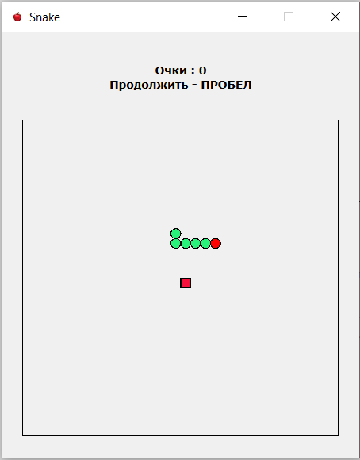
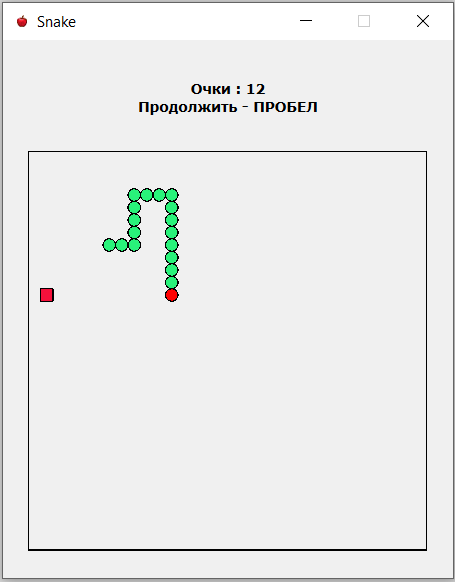
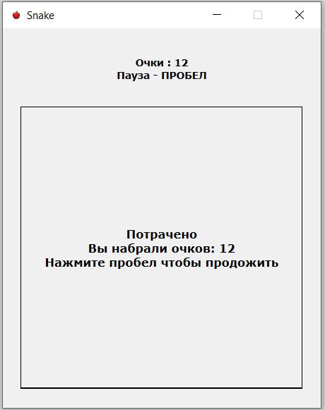

# Игра "Змейка"

Эта программа представляет собой классическую игру "Змейка", где игрок управляет змейкой, которая движется по игровому полю, поедает пищу и постепенно растет в длину. Цель игры — набрать как можно больше очков, избегая столкновений с телом змейки. При пересечении границ игрового поля змейка появляется с противоположной стороны.

## Основные функции

1. **Управление змейкой**: Игрок управляет направлением движения змейки с помощью клавиш со стрелками (вверх, вниз, влево, вправо).
2. **Пауза**: Игру можно поставить на паузу и возобновить с помощью клавиши пробела.
3. **Увеличение скорости**: Каждые четыре съеденных яблока увеличивают скорость змейки.
4. **Счетчик очков**: В игре реализован счетчик очков, который отображает текущие очки игрока.

## Скриншоты

- Начало игры:

  

- Игра в процессе:

  

- Конец игры:

  
  
## Используемые технологии
  
### Язык программирования:
- C++

### Использованные библиотеки и классы:

- **QMainWindow**: Главное окно приложения, обеспечивает базовую структуру интерфейса.
  
- **QLayout**: Упорядочивание размещения виджетов в главном окне.
  
- **QWidget**: Базовый класс для создания графических пользовательских интерфейсов в Qt.
  
- **QPainter**: Рисование графики игровых объектов и фонов.
  
- **QTimer**: Используется для обновления отрисовки змейки.
  
- **QKeyEvent**: Обработка пользовательского ввода с клавиатуры для управления змейкой.
  
- **QRandomGenerator**: Создание случайных событий в игре, таких как расположение новых яблок и других игровых элементов.

